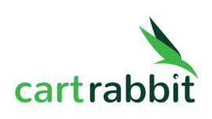

# WaitList Application:-

This is the Waitlist Application developed for Cartrabbit.

## Installation

### MongoDB Atlas

To get started, you need to set up a MongoDB Atlas cluster and obtain the database access string. Follow these steps:

1. Create a MongoDB Atlas account and sign in.

2. Create a new cluster and configure it.

3. Once your cluster is up and running, click the "Connect" button.

4. Copy the provided database access string.


### Setting up the Development Environment

Before you can start developing this project, you need to set up your development environment. Make sure you have the following prerequisites installed:

- Python 3.9 or higher
- MongoDB Atlas
- MongoDB Compass[https://www.mongodb.com/try/download/compass]
- PostMan
- Git & Github
- AWS EC2, S3 (For Deployment purpose only not mandatory)


## Developing:

1. Clone the project repository:

```shell
git clone https://github.com/ElangoSubramani/Waitlist-Application.git

cd Waitlist-Application/
```
(Note: It is recommended to create virtual environment in order to isolate the packages)

2. Install the project dependencies using the following command:

```shell
pip install -r requirements.txt 
```

## MongoDB Compass Setup

1. Open MongoDB Compass and connect to your MongoDB Atlas cluster using the access string you copied earlier.

2. Update the environments.env with your database access string .


3. The file environments.env contains MONGODB_ACCESS_KEY, I,ve already given my access key please use it for verification purpose only

### Run the API Server

1. Ensure that your Python program is correctly updated with the database access string.

```shell
   python3 api_server.py
   ```

The API should now be running locally. By default, Flask applications run on localhost (127.0.0.1) and port 5000.

### Testing APIs with Postman

1. Open Postman on your local machine.

1. Use Postman to make HTTP requests to your locally running API.

#### To test a specific endpoint, follow these steps:

1. Open Postman and create a new request.

2. In the request type dropdown, select the appropriate HTTP method (e.g., GET, POST, PUT, DELETE) that corresponds to the API endpoint you want to test.

3. In the request URL field, enter the URL of your local API. By default, it will be something like this:

```shell
http://127.0.0.1:5000/admin_login/admin@gmail.com/admin
```
4. Click the "Send" button to make the request. Postman will display the response from your API.


## Example API Test
### POST
```shell
http://127.0.0.1:5000/signup
```
### BODY (RAW)JSON
```shell
{

            "email": "samplemail@cartrabit1.com",
            "name": "ELANGO S",
            "password": "1234"
 }

```
### RESPONSE
```shell
{
    "email": "samplemail@cartrabit1.com",
    "message": "You have been added to the waiting list",
    "name": "ELANGO S",
    "password": "1234",
    "position": 99,
    "referral_link": "http://127.0.0.1:5000/refer_friend/signup/samplemail$cartrabit1&com",
    "total_refers": 0
}
```

## Kindly refer the POSTMAN SAMPLE DATA (1).pdf for sample data format(GET, POST, PUT, DELETE)

<br>

### Reach me out!

  [](https://www.linkedin.com/in/elangosubramani/)   [](mailto:elangoraj651@gmail.com)
<br>

# THANK YOU !!!!!!!!!!!!!!